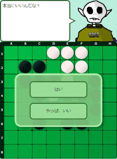
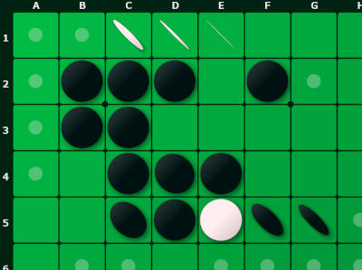
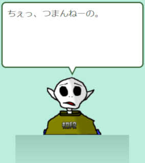
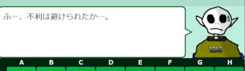
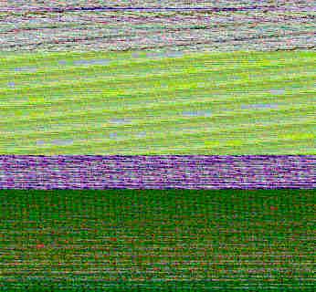

# [bthello](https://github.com/kozok-dev/bthello/)で使われた技術

## 目次

* [はじめに](#はじめに)
* [レスポンシブデザイン](#レスポンシブデザイン)
* [SVG](#svg)
* [アニメーション](#アニメーション)
* [非同期処理とPromise](#非同期処理とpromise)
* [サウンド](#サウンド)
* [キャラクター](#キャラクター)
* [PWA](#pwa)
* [思考するコンピューター](#思考するコンピューター)
* [Web Worker](#web-worker)
* [バイナリデータの読み込み](#バイナリデータの読み込み)
* [asm.js](#asmjs)
* [その他](#その他)
* [おわりに](#おわりに)

## はじめに

ここに書かれている内容は2019年時点のもので、Edge含む多くのモダンブラウザで動作するが、IE11のような古いブラウザでは動作しない機能もあるので注意。

<center>

<br>
<font size="-1">PCで表示した画面</font>

</center>

本アプリはJavaScriptで書かれ、PCはFirefox、Chrome、Edge、スマホはAndroid、iOSを動作対象としている。<br>
Webでできるキャラの反応を楽しむお手軽オセロゲームアプリを目指し、人間でも勝てるよう調整しているため、コンピューターの強さはおまけ程度の認識でよい。

## レスポンシブデザイン

同じHTMLソースでPCとスマホが表示できるよう、CSSの機能で画面のサイズに応じて自動的に表示が切り替わる。<br>
多くのスマホユーザーは端末を縦向きに持つので、本アプリでもそのような縦長の画面設計とし、PCでは横長とした。

<center>

<br>
<font size="-1">スマホサイズで表示した画面</font>

</center>

複雑なものを除き、この程度の処理ならJavaScriptいらずで実現できる。<br>
といっても、本アプリでは対応しきれない部分があったので補助的にJavaScriptを使用した。

## SVG

SVGとはスケーラブル・ベクター・グラフィックスの略。<br>
オセロの盤面をどう表現するか、画像でもよいが4K画質等の巨大なスクリーンでもキレイに表示したい場合、SVGが選択肢に入る。<br>
SVGは線を引く、多角形や円を描くといったことが可能で、普通の画像と異なりベクター情報で保持されるので、画質が画面の大きさで左右されない。

本アプリではそれなりにリッチな表現にするため、黒石・白石それぞれにグラデーション、ぼかし、影の表現をつけた。
もちろん、大きな画面で表示しても画質は変わらない。

<center>

<br>
<font size="-1">SVGで描かれたオセロ盤面</font>

</center>

ぼかし処理は重いため一部スマホ機種では動作しないようJavaScriptを加えている。<br>
全ての表示をSVGやCanvasにすることも出来なくはないが、今回はオセロ盤面のみSVGにした。

## アニメーション

今ではコンテンツスライダーと呼ばれるスライドアニメーションする画像が珍しくなくなり、複雑な動きをするサイトも多い。<br>
また、スマホゲームに触れてもわかるようにあらゆる要素がアニメーションしている。<br>
お気に入りのゲームをそういった側面で見てみるのもいいだろう。

本アプリでは、石を返す、ダイアログの表示、キャラクターのセリフ表示等できる限り多くの要素をアニメーションさせている。<br>
こういうアニメーションがないだけで面白くなさそうな印象を与えてしまうだろう。

<center>

<br>
<font size="-1">キャラクター画像とセリフ表示。絵は高校時代に描いたものを流用</font>

</center>

アニメーションさせる場合、`setTimeout`を使用して開始時の時間を保持しておき、その時間との差をアニメーション変化に利用することがあるが、
時間の取得は今なら日付関数より時刻のズレ等を考慮しなくてよい`performance.now()`を使用できる。<br>
また、`setTimeout`より`requestAnimationFrame`の方が適切だ。

アニメーションさせる際に注意しなければならないこととして、アニメーション中にユーザーがクリックする等の割り込み処理がある。

実は本アプリは対人戦で確認できるが、石を返すアニメーション中に次の石を打っても問題ない作りになっていて、
割り込むとアニメーションが止まり、次のアニメーションに移行する。

一方で、アニメーション中は操作不可にした方が良い場合もある。<br>
ダイアログのアニメーション中に際どいタイミングで、誤操作等でボタンをクリックできてしまったらユーザーは何をクリックしたか分からなくなるだろう。

他にも、ダイアログに表示されているボタンを押すと押したことがわかるアニメーションが発生する。<br>
スマホは画面が小さいため誤操作のリスクがあるから、こうすることで明確にできる。

アニメーションは画面を華やかにするだけでなく、わかりやすさの面からでも重要だ。<br>
他にも繋げて別のアニメーションを行うためのキューの仕組みもあるが、説明は割愛する。

## 非同期処理とPromise

アニメーション処理とも関連するが、アニメーションしている最中もユーザー操作を受け付けることができる。<br>
つまり、アニメーションは非同期で実行されていることになる。
このように、ソースから見て処理が上から実行されていくとは限らないケースがあり、非同期実行と呼ばれる。<br>
クリックといったユーザー操作等のイベントドリブンも非同期実行の一種といえよう。

非同期実行は多くの場合、処理を複雑にし、「コールバック地獄」と呼ばれるソースの可読性低下を招く。
Promiseはそんな複雑さに対応できる機能を持ち、本アプリでもいたる所にある。

その他、より分かりやすくなったasync/awaitという機能もある。

## サウンド

ブラウザで音が出るゲームも当たり前のように存在するが、一昔前ならFlash等で代用していたものだ。<br>
本アプリでも自作の効果音等を再生する際、HTML5初期のAudioも一応選択肢にあったが、Web Audio APIを使用している。<br>
このAPIは音声のバイナリデータにもアクセスできるため、高度な処理を行うことも可能だ。

## キャラクター

Web技術とは関係ないが、本アプリの特徴なので紹介する。<br>
コンピューターにキャラクター性を持たせるためにキャラ画像を用意して形勢に応じて表情を変え、セリフも変化するようにした。<br>
様々な表情とそれに合ったセリフバリエーションを用意することで、キャラの反応を楽しめる。<br>
欠点としては、表情で形勢がすぐ分かるので、終局までいかなくても結果が予測できてしまうことか。<br>
特に終盤になると、コンピューターは読み切りによって対局途中でも結果が分かってしまう。

<center>

<br>
<font size="-1">形勢に応じたキャラクターの表情とセリフ</font>

</center>

## PWA

PWAとはプログレッシブ ウェブ アプリの略で、要するにそのままスマホアプリにもなれるWebアプリのことだ。<br>
AndroidでPWAに対応したページを開くと、自動的に「インストールしますか」という通知が表示される。<br>
Cordova等のモバイルアプリフレームワークを使うことなく、また、Google PlayやApp Storeに登録しなくてもスマホアプリとしてインストール可能となる。

PWAとして動作させるにはアプリアイコン等を定義したjson形式のmanifestを記載し、Service Workerという主にオフライン時の扱いをどうするかの実装を行う。<br>
正しく実装すると特定のイベントが発生するので、それを処理すればオリジナルのインストールボタンも設置できる。

Chromeに以下の引数を指定して実行するとローカルWeb環境でも動作確認できる(`--user-data-dir`に各種設定ファイルが作られる)。
```
--ignore-certificate-errors --unsafely-treat-insecure-origin-as-secure=https://localhost/ --allow-insecure-localhost --user-data-dir=/work/chrome
```

## 思考するコンピューター

Web技術とは関係ないが、コンピューターオセロでは重要な項目なので紹介したい。<br>
二人零和完全情報ゲームであるオセロは、ゲーム木探索を行うことが基本となる。

コンピューターが手を決定する際、定石が使える段階を序盤、読み切りが可能な局面を終盤、それ以外を中盤と定義する。<br>
通常1手読みより2手読みの方が強いので、コンピューターのレベルを上げるときは先読み手数を増やす。

普通の人間でも勝率が上がるよう、終盤以外の打つ手にランダム性を持たせてある。<br>
ランダム打ちVSコンピューターを百戦ほどさせて、オセロを知らない人でもある程度の勝率となるよう調整した。

### 序盤

予め読み込まれた10万局面以上の定石データベース(通称book)から現在の局面と一致するものを二分探索や線形探索といった探索アルゴリズムで高速に探す。<br>
定石といっても善し悪しがあるため、完全なランダムで選ぶわけではない。<br>
定石データベースは予め[minmax法](https://github.com/kozok-dev/samples/blob/master/gametree/1-minmax.md)による評価値がセットされている。

通常は終盤と呼べる段階でも定石データベースにヒットすれば、コンピューターにとっては序盤となる。<br>
具体的なデータ構造を簡単に述べると黒石情報8バイト、白石情報8バイト、手番1バイト、評価値1バイト、予約領域2バイトで1レコードである。<br>
ちなみに、黒石や白石の計算にはビット演算を用いており、ビット演算について踏み込むと興味深い様々な計算方法があり、並列処理しやすいこともあってグラフィックボードのGPGPUの世界にまで足が及ぶ。

### 終盤

あえて先に終盤の説明をするが、この段階はコンピューターが最も得意とする局面であり、オセロ有段者でさえ真似できない領域となる。<br>
オセロは終盤になると打てる数が減り、コンピューターが有限時間内に最後まで読み切れるようになるので、対局途中であっても結果を知ることができる。<br>
minmax法の特性もあって、この段階でコンピューターに「勝ち」を読み切られてしまったら、相手はどう頑張っても勝てない。

いかに速く読み切るかが重要であり、いくつかの手法が考案されているが、本アプリはコンピューターの強さを追及しているわけではないので、比較的簡易な実装([nega-αβ法](https://github.com/kozok-dev/samples/blob/master/gametree/2-ab1.md))にとどめている。

### 中盤

探索処理は終盤と同じアルゴリズムを用い、形勢を決める評価関数はかつてLogistelloという強豪オセロプログラムで実装された手法を採用し、ランダムを加える。<br>
その手法は説明するとそれだけで長文となるので省くが、昨今のAIのように機械学習によって評価値データを作成し、それを読む形で形勢を決定する。

## Web Worker

WorkerとはそれまでなかったJavaScriptでマルチスレッドを取り扱う技術だ。

`setTimeout`等の非同期処理は実行タイミングこそマルチスレッドのように見えるが、あくまでシングルであり、非同期処理内で無限ループでも走らせようものならブラウザが固まるだろう。<br>
しかし、Workerの登場によりゲーム木探索処理等の高負荷な処理を別スレッドで実行させることが可能になった。もちろん、別スレッドでならブラウザが固まることもない。

制約はあるが、その分スレッドセーフなのでマルチスレッドプログラミング特有の問題に悩まされることはないだろう。

## バイナリデータの読み込み

[思考するコンピューター](#思考するコンピューター)にもあった10万局面以上の定石データベースや評価値データはバイナリデータであり、容量も大きい。<br>
これを読み込ませるのにJavaScriptに直接記述は現実的ではない。

方法として、型付き配列と呼ばれるものを使用する。<br>
本来、型の概念がないJavaScriptにC言語にあるようなchar型、int型の配列を定義できるのだ。これにより、簡単にバイナリデータを扱える。

次に、大容量データを読むことについてだが、まず思いつく方法としてWeb2.0の時代よりajaxによる非同期読み込み機能がある。<br>
これなら画面描画を邪魔しないので多少容量が大きいのを我慢できるが、参考にした方法として少しトリッキーだが以下がある。

1. 予め、バイナリデータを画像のピクセルデータにしてpng画像にしておく。
1. Canvasに画像を読み込み、画像のピクセルデータを取得できるのでバイナリデータとして扱う。

<center>

<br>
<font size="-1">画像化した評価値データ</font>

</center>

これならpngにて圧縮されるので容量を節約できる。もちろん可逆圧縮なのでバイナリデータが狂うこともない。<br>
注意点として、透過情報があるとピクセルデータが変化してしまう可能性があるので、24ビットの透明情報なしのpngにする必要がある。<br>
また、Canvasで読み込むと必ず32ビットになるので、取得の際はアルファ値を無視する。

## asm.js

asm.jsとは、型の概念がないJavaScriptに型を強制させることによって、C言語で作ったかのような高速処理をさせることができる技術でFirefoxを開発しているMozillaによって生み出された。<br>
近年のWebGLや物理計算等の高速化需要もあって、他のブラウザベンダーも追従し、Edge含む多くのモダンブラウザでも実装された。

本アプリでも場合によって50%以上の高速化ができた。<br>
ただし、それと引き換えに特殊な記述をしなければならないため、ソースの可読性は低下する。<br>
また、配列が1つしか使えないので、どの領域をどのデータとして扱うか、まるで本当にアセンブリ言語で組むかのような気分になる。<br>
幸い、asm.js化したいJSコードは必要最低限にできるので、関係ないコードまで影響が及ぶことはない。

その特殊な表記のためにとっつきにくく、代わりとしてWebAssemblyというのがあるが本アプリでは使用していない。

## その他

### 開発

当初Firefoxでabout:configから`security.fileuri.strict_origin_policy`を`false`に設定し、ローカルファイルの読み込みを可能にして動作確認していた。<br>
最終的にnode.jsでリリース版としてuglifyやminifyと言われるものを使ってソース内のコメントやインデント、改行を除去した。

### jQuery

HTMLの操作には全面的にJavaScriptライブラリのjQueryを採用している。<br>
かつてIEを中心に多くのWeb技術者を困らせてきた時代、ブラウザごとに異なるコードを書かなければならなかった時代にとっては、必須に近いライブラリで今でも非常によく見かける。

Vue.js等のフレームワークが台頭し、他のブラウザごとの差異が少なくなってきた今では昔ほどの有用性はないが、まだまだ使える。

### JavaScriptの有効、CSS変更監視

本アプリではJavaScriptの有効無効、CSS有効無効の計4パターンで見栄えが悪くなることを防止する細かい処理を行っている。<br>
といっても、どちらかが無効では何もできないので「Error」だけ表示して、『不格好な内容が表示されるくらいならErrorとだけ表示するほうがマシ』という考えのもとで対処する。

CSSだけは有効無効を途中で切り替えられるのでIntersectionObserverという機能を利用し、無効になったと検知するとHTML構造を書き換え、Error表示にする。<br>
ただ、IntersectionObserverは本来こういったことに使う機能ではないということを付け加えておく。

### JavaScriptの今後を決めるECMAScript

これは技術の名称ではなく、JavaScriptの仕様を決めている規格である。ESと略され、特に大きな改修であるES2015(ES6)が策定されたときには、有用な機能が多く追加された。<br>
ES2015を利用しているかどうかで、今どきのJSコードが書けているか分かると言っても過言ではない。<br>
ただし、あまり気張るのも良くないのでほどほどに意識する程度でよいと思う。<br>
ちなみに、本アプリではES2015がほぼ非対応のIE11に対応するか不明確のまま開発していたので、Babelという手はあったものの、ほとんど使用していない。

## おわりに

ここまで挙げてきたWeb技術を利用して本アプリを作ったので得られたスキルは多い。<br>
Webアプリはブラウザさえあればどの環境でも動くので、従来のスマホアプリより開発コストを下げることができる上、手軽に動作確認できる。

WebXR等、Web技術はこれからも多機能化、高速化を続け、デスクトップアプリと差がなくなってゆくと予測する者もいる。<br>
我々になくてはならないネット。それを支えるWeb技術。<br>
インターネットが無くなることはないだろうし、Web技術も同様だ。<br>
FlashやSilverlight、VB6など廃れていったものも決して少なくない中でWeb技術は生き残り続けるだろう。
