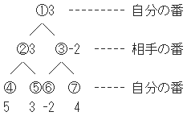

## ゲーム木探索：ミニマックス法

Draft created at 2002

思考ゲームプログラミングではコンピューターに先読みさせる方法として、ゲーム木という考え方とそれを探索する｢ミニマックス法｣がある。  
このアルゴリズムは、自分の番は自分にとって最も有利(max)に、相手の番は自分にとって最も不利(min)になるようにするというもの。

上記のゲーム木を例にとると、局面が①のとき、②と③のどちらを選択すべきか。  
①は自分の番なので最大値である②が正しい。  
②を選ぶと、④か⑤を選択するが、ここは相手の番なので最小値、つまり⑤になる。  
その局面の形勢を数値で表したものは評価値と呼ばれる。  
ミニマックス法は全ての手を調べるため、無駄な時間がかかってしまう。

また、ある局面をAとして選択できる評価値が｢-1｣｢+3｣｢+0｣｢+2｣｢+2｣、Bという局面では｢-5｣｢-6｣｢-3｣｢-4｣｢+8｣とする。  
ミニマックス法なら、自分の番だとして最大値があるBが選ばれるのだが、｢+8｣以外はどれも不利になるものばかりで、人間だとAを選んだとしても、自分が不利になる確率は低い。
