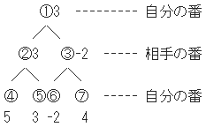
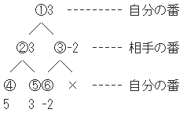
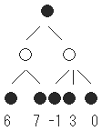
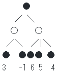

## ゲーム木探索：αβ法

Draft created at 2002

αβ法はミニマックス法を改良し、必要のない部分は読まないように(枝刈り)したものである。

「必要のない」というのはこのゲーム木の場合、通常は縦型(子優先)検索なのでまず、①②④と調べ、次に⑤、次に③⑥、⑦と探索していく。
まとめると、この木の探索順は以下になる。

A．①②④  
B．⑤  
C．③⑥  
D．⑦

AとBが終了した時点で、①の評価値は確実に3以上であることがわかる。  
次にCが終了すると③は-2になるが、相手の番なので、この時点で③は確実に-2以下になる。  
これは、①で仮決定している3より低い。つまり、③の子をこれ以上調べても①の評価値に変化はなく、⑦を調べる必要はないのである。  
調べようとしている局面が相手の番のときの枝刈りを｢αカット｣、自分の番のときは｢βカット｣と呼ぶ。

｢×｣が枝刈りが起こる部分である。αβ法では、この枝刈りにより探索効率を向上させ、時間を節約することができる。

この枝刈りの頻度を上げるには、良さそうな所から探索していくのが良い。  
並びが悪いと最悪の場合、枝刈りが一度も起こらず、ミニマックス法と同じ効率になってしまう。  
そのため、本格的に探索する前に軽い探索をして並べ替えておく手法もある。

  
最適な並びをしているゲーム木

  
最悪な並びをしているゲーム木

## 参考ソース

- [kozoothello](https://github.com/kozok-dev/kozoothello/blob/master/ab.c)
- [bthello](https://github.com/kozok-dev/bthello/blob/master/src/comwork.js) ※nega-αβ法
