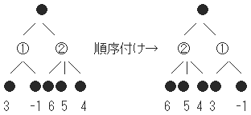
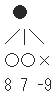

## ゲーム木探索：順序付けによるαβ法と前向き枝刈り

Draft created at 2002

αβ法において、枝刈りの条件はα≧βであるため、最初からα値は高く、β値が低ければ枝刈りが起きやすくなる。  
そのためには、探索する前に｢順序付け｣をするとよい。浅い先読み(Shallow Search)で得られた評価値をもとに、自分の番は評価値の高い順に、相手の番は低い順に並べ替える。

上記のように、そのままだと枝刈りが1度も起こらないが、順序付けをすると起こりやすくなる。

また、これを使ってあきらかに悪い手に関してはこれ以上先読みしないという方法がある(前向き枝刈り)。  
これは、好手を損する可能性があり、浅い読みでは悪手だが、深く読むと実は好手という場合だ。
評価関数の精度が良ければ、このようなことが起こる確率は低くなる。  
前向き枝刈りについてはより発展した手法があるが、ここでは割愛する。

  
前向き枝刈りの例

## その他

Negamax、PVS等、より発展した手法を[bthello](https://github.com/kozok-dev/bthello/)や[kozoothello](https://github.com/kozok-dev/kozoothello/)で採用している。
